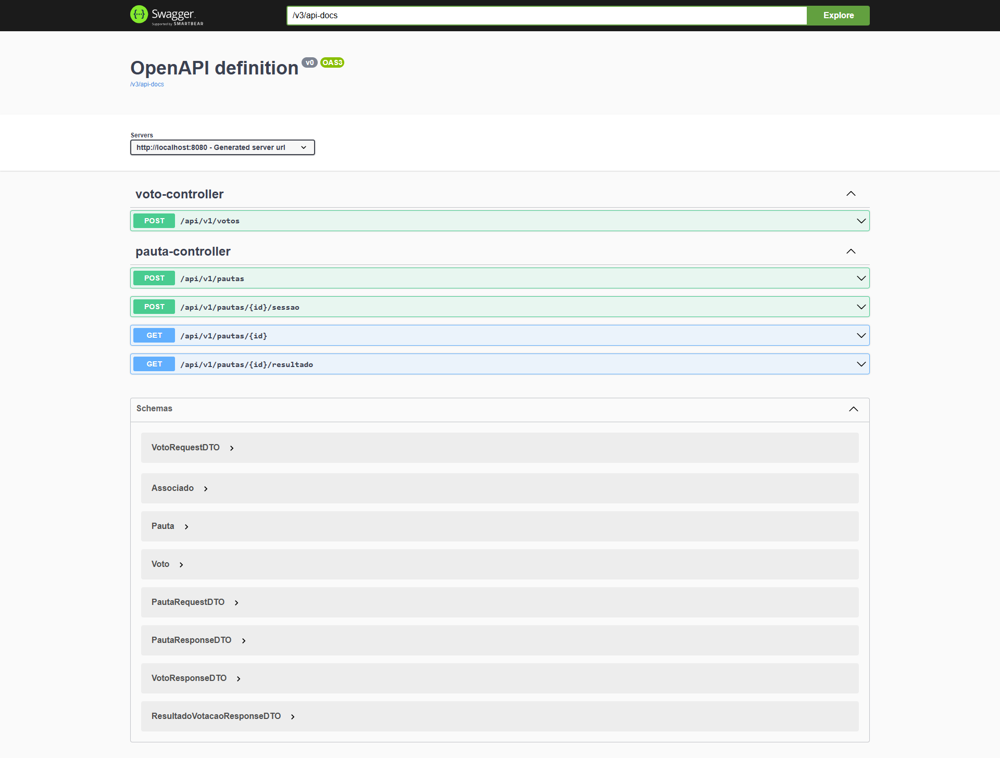

# 🗳️ Cooperativa Votação - API REST

API desenvolvida para o gerenciamento de pautas e sessões de votação em uma cooperativa. A aplicação permite o cadastro de pautas, abertura de sessões, registro de votos por CPF, contabilização de resultados e integração com serviço externo para validação de CPF.

---

## 🚀 Tecnologias Utilizadas

- Java 17  
- Spring Boot  
- Spring Data JPA  
- H2 (ambiente de testes)  
- PostgreSQL (ambiente de desenvolvimento)  
- Swagger / OpenAPI  
- JUnit 5 + Mockito (testes unitários)  
- Flyway (migração de banco de dados)  
- Maven

---

## 📐 Arquitetura e Organização

- Projeto estruturado com base em arquitetura **MVC**.
- Separação clara entre camadas:
  - `controller`: expõe endpoints REST
  - `service`: regras de negócio
  - `repository`: acesso a dados
  - `model`: entidades JPA
  - `dto`: comunicação externa
  - `exception`: tratamento de erros
- Uso de **DTOs** para entrada e saída de dados, evitando o acoplamento com entidades.

---

## 🎯 Decisões de Design

- **Simplicidade acima de tudo**: funcionalidades implementadas diretamente ao ponto, sem complexidade desnecessária.
- **Clareza**: código fácil de entender, classes com nomes objetivos, boas práticas de nomenclatura.
- **Manutenibilidade**: estrutura limpa, testes cobrindo casos de uso principais, e tratamento centralizado de exceções.
- **Reaproveitamento e modularidade**: serviços reutilizáveis e isolados.

---

## ✅ Funcionalidades

- Cadastro de pauta (título e descrição)
- Abertura de sessão de votação com duração definida (default: 1 minuto)
- Registro de votos (CPF e nome)
- Consulta ao resultado da votação
- Evita votos duplicados
- Validação de CPF via API externa pública

---

## ⚠️ Tratamento de Erros

- Exceções específicas criadas para regras de negócio:
  - `PautaNaoEncontradaException`
  - `SessaoJaAbertaException`
  - `SessaoEncerradaException`
  - `SessaoNaoIniciadaException`
- Validações de entrada via Bean Validation (`@Valid`, `@NotNull`, `@Pattern`, etc.)
- Tratamento centralizado em `GlobalExceptionHandler`, com retorno padronizado de erros.

---

## 🧪 Testes Automatizados

- **Testes unitários** com:
  - `JUnit 5`
  - `Mockito`
- Casos de sucesso e falha cobrindo:
  - Registro de voto
  - Sessão não iniciada
  - Sessão encerrada
  - Voto duplicado
  - CPF inválido

---

## 📖 Documentação da API

- Acesso via **Swagger UI**:
  - [http://localhost:8080/swagger-ui/index.html](http://localhost:8080/swagger-ui/index.html)
- Todos os endpoints são documentados e testáveis via interface web.

---
## 📸 Swagger UI



## 📋 Execução Local

1. Clone o repositório
2. Execute com:
   ```bash
   ./mvnw spring-boot:run
